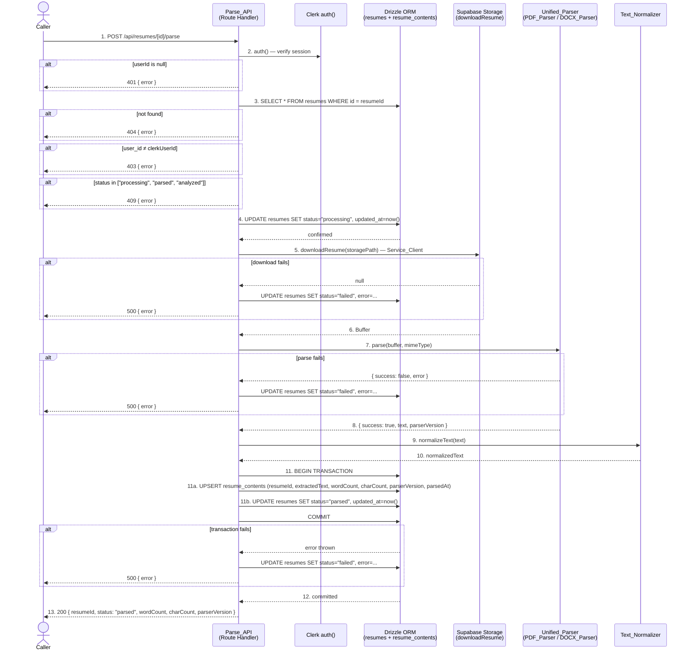

# Design Document: Resume Parsing Pipeline

## Overview

The Resume Parsing Pipeline is a backend feature that extracts plain text from uploaded resume files (PDF or DOCX) stored in Supabase Storage. It is triggered by a `POST /api/resumes/[id]/parse` request from an authenticated user.

The system is composed of:

- **Parse_API** (`app/api/resumes/[id]/parse/route.ts`) — the Next.js Route Handler that orchestrates authentication, ownership verification, status management, file download, format routing, text normalization, and database persistence.
- **PDF_Parser** (`lib/parsers/pdf-parser.ts`) — wraps `pdf-parse` to extract text from PDF buffers.
- **DOCX_Parser** (`lib/parsers/docx-parser.ts`) — wraps `mammoth` to extract text from DOCX buffers.
- **Unified_Parser** (`lib/parsers/unified-parser.ts`) — routes a buffer to the correct parser based on MIME type.
- **Text_Normalizer** (`lib/parsers/text-normalizer.ts`) — cleans and normalizes raw extracted text.

All sensitive operations run exclusively in the Node.js server environment. The browser triggers parsing with a simple POST but never receives extracted text or file content.


---

## Architecture Decision 1: Where to Store Extracted Text

### The Two Options

**Option A — Add `extractedText` column to the existing `resumes` table**

Add `extracted_text text` (nullable) to `resumes`.

- Pro: no JOIN needed; one table for all resume data; simpler queries from the AI Analysis Pipeline.
- Con: the `resumes` table becomes wide with a large text blob mixed into metadata columns; large text can hurt index performance on non-text columns; the column cannot track parsing version history; a re-parse would silently overwrite the previous result with no audit trail.

**Option B — Create a new `resume_contents` table**

Create `resume_contents` with: `id`, `resume_id` FK, `user_id` FK, `extracted_text`, `word_count`, `char_count`, `parser_version`, `parsed_at`.

- Pro: clean separation of concerns; `resumes` stays a lean metadata table; `resume_contents` can be indexed independently; `parser_version` enables re-parse detection; a future upsert cleanly replaces the row; the AI Analysis Pipeline queries a purpose-built table; isolated indexing for full-text search on `extracted_text` if needed later.
- Con: one extra JOIN when the AI Analysis Pipeline reads both metadata and text together; one additional migration.

### Chosen Approach: Option B

**A dedicated `resume_contents` table is used.**

Rationale:

1. The `resumes` table is already the central metadata record for the entire application. Appending a potentially large text blob would degrade the performance of every query that scans `resumes` for status, ownership, or listing — none of which need the text.
2. `parser_version` is a first-class requirement. The AI Analysis Pipeline will need to know which library version produced the text to decide whether re-parsing is warranted after a library upgrade. This metadata fits naturally on `resume_contents` but is semantically wrong on `resumes`.
3. The JOIN cost is negligible at MVP scale. The AI Analysis Pipeline will query `resume_contents` directly using `resume_id` — a primary-key FK lookup with a single row per resume.
4. Option B is the right call for long-term health without over-engineering: a second table with a clear foreign key is not complex; it is idiomatic relational design.


---

## Architecture Decision 2: Resume Status Design

### The Options

**Option A — Keep existing 4-value enum as-is: `"pending" | "processing" | "analyzed" | "failed"`**

`"processing"` covers both the parsing phase and the analysis phase. `"analyzed"` means both parsed and analyzed.

- Pro: no migration to the enum; no schema change beyond `resume_contents`.
- Con: the AI Analysis Pipeline cannot query `WHERE status = 'parsed'` to find resumes ready for analysis without inspecting `resume_contents`; `"processing"` is ambiguous between "parse in progress" and "analysis in progress"; debugging a stuck resume requires inspecting both tables.

**Option B — Add `"parsed"` to produce: `"pending" | "processing" | "parsed" | "analyzed" | "failed"`**

- Pro: explicit, queryable signal that parsing is done and the resume is waiting for AI analysis; the AI Analysis Pipeline has a clean `WHERE status = 'parsed'` query; debugging is unambiguous; the state machine has one state per pipeline stage.
- Con: requires an `ALTER TYPE … ADD VALUE` migration.

### Chosen Approach: Option B

**`"parsed"` is added to the `resume_status` enum.**

Rationale:

1. The whole point of this feature is to produce a "ready for AI" signal. Without `"parsed"`, the AI Analysis Pipeline has no clean way to identify resumes that have completed text extraction but not yet been analyzed. It would need to JOIN `resume_contents` just to determine readiness — coupling the analysis pipeline to parsing internals.
2. `ALTER TYPE … ADD VALUE` is a non-destructive migration. It does not require rewriting existing rows or locking the table. It is the right level of change for a clearly necessary state.
3. The resulting state machine is clean and unambiguous: `pending → processing → parsed → (AI pipeline) → analyzed`, with `failed` reachable from `processing`.

**Resulting `resume_status` enum order:** `"pending"`, `"processing"`, `"parsed"`, `"analyzed"`, `"failed"`.


---

## Architecture Decision 3: Parsing API Design

### The Options

**Option A — `POST /api/resumes/[id]/parse` — separate endpoint triggered after upload**

- Pro: clean separation of Upload and Parse concerns (Single Responsibility Principle); the parse step is independently retryable (e.g. after a library bug fix); the client can trigger parsing at the right moment (immediately after upload, or deferred); upload latency is not affected by parse time; future queue-based or webhook-triggered architectures fit naturally.
- Con: requires an explicit POST from the client after upload; the client orchestrates two calls.

**Option B — Parse immediately inside `POST /api/resumes/upload` after the DB insert**

- Pro: one API call from the client's perspective; marginally simpler client.
- Con: couples Upload and Parse into a single route handler; the upload HTTP response does not return until parsing completes (PDF parsing can take 200–800ms; DOCX is similar); if parsing fails, the upload route must decide whether to return 201 or 500 for an operation that already succeeded at the storage level; retrying parsing independently becomes impossible without a separate endpoint anyway.

### Chosen Approach: Option A

**`POST /api/resumes/[id]/parse` is a dedicated, separate endpoint.**

Rationale: The Upload Pipeline is complete and in production. Parsing is a distinct, independently-failable operation. The two steps should have independent retry semantics. Upload time must not grow with parse time. Option A is the correct architectural choice and matches the design of the completed Upload Pipeline.


---

## Architecture Decision 4: Supabase Storage Access Pattern

### The Two Methods

**Method A — Generate a signed URL and fetch it**

Call `getResumeSignedUrl(storagePath)` → receive a short-lived HTTPS URL → fetch the URL to retrieve bytes.

- Pro: works with any HTTP client; the URL can be passed around.
- Con: exposes a time-limited public URL even if only for milliseconds; adds a network round-trip (Storage API call to generate URL, then another HTTP request to download); the URL could be logged; unnecessarily complex for a server-to-server operation.

**Method B — Direct server-side download via Service_Client**

Call `createServiceClient().storage.from("resumes").download(storagePath)` → receive a `Blob` directly in memory.

- Pro: no URL is generated; no external HTTP hop; the Blob is available immediately in-process; the Service_Client already has full bucket access; simpler, fewer network calls; no risk of URL exposure in logs.
- Con: returns a `Blob` that must be converted to `Buffer` (one line: `Buffer.from(await blob.arrayBuffer())`).

### Chosen Approach: Method B

**Direct `supabase.storage.from("resumes").download(storagePath)` via `createServiceClient()`.**

Rationale: The file never leaves the server process. No URL is generated, logged, or leaked. The download call is atomic — it either returns the Blob or an error. This is the idiomatic server-side pattern for private bucket access and is safer and simpler than the signed-URL approach.

A new helper `downloadResume(path): Promise<Buffer | null>` is added to `lib/supabase/storage.ts` to encapsulate this pattern, following the existing convention of that file.


---

## Architecture Decision 5: PDF and DOCX Libraries

### PDF Parsing

**Candidates:**

- `pdf-parse` — battle-tested, Buffer-based API: `pdfParse(buffer)` returns `{ text, numpages, info }`. Zero native dependencies. TypeScript support via `@types/pdf-parse`. Actively maintained. Works in serverless Node.js environments.
- `pdfjs-dist` — Mozilla's reference PDF.js implementation. Complete feature set but significantly heavier bundle; requires additional setup for the Node.js environment (worker threads, CMaps); overkill for plain-text extraction.

**Chosen: `pdf-parse`**

Rationale: `pdf-parse` is the industry standard for server-side plain-text extraction from PDFs in Node.js. Its Buffer-based API matches the download pattern exactly. For MVP, its text extraction quality is sufficient. `pdfjs-dist` adds complexity without benefit at this stage.

**Install:** `npm install pdf-parse@1.1.1` and `npm install --save-dev @types/pdf-parse`

### DOCX Parsing

**Candidates:**

- `mammoth` — converts DOCX to plain text (or HTML). Handles paragraphs, headings, bullet lists, and table cells. Buffer-based API: `mammoth.extractRawText({ buffer })`. Built-in TypeScript types. Actively maintained. Widely used.
- `docx-parser` — lighter but less actively maintained; fewer structured element handlers.

**Chosen: `mammoth`**

Rationale: `mammoth` is the standard choice for DOCX text extraction in Node.js. Its `extractRawText` method handles all common resume structures (sections, bullets, tables) and its Buffer API is a direct fit. Built-in TypeScript means no separate `@types/*` package.

**Install:** `npm install mammoth@1.9.0`

### Runtime Constraint

Both libraries operate on in-memory `Buffer` objects. Neither requires file system access or native compiled add-ons. Both run correctly in a serverless Node.js environment. The route file must declare `export const runtime = "nodejs"` to prevent Next.js from assigning the edge runtime to this route.


---

## Architecture

The Parse Pipeline follows the same strict server/client boundary as the Upload Pipeline.

- The **browser** (or any API caller) sends a single `POST /api/resumes/[id]/parse` with no body. It receives a JSON result.
- The **server** runs the Parse_API exclusively: Clerk session verification, DB lookups, Supabase Storage download, in-memory parsing, text normalization, transactional DB writes.

No parsing library, Supabase client, or Drizzle instance is ever imported in a client component. The browser never sees file bytes or extracted text.

**Module layout:**

```
app/api/resumes/[id]/parse/route.ts   ← Parse_API (Route Handler)
lib/parsers/
  pdf-parser.ts                        ← PDF_Parser
  docx-parser.ts                       ← DOCX_Parser
  unified-parser.ts                    ← Unified_Parser + ParseResult type
  text-normalizer.ts                   ← Text_Normalizer
lib/supabase/storage.ts                ← add downloadResume() helper
db/schema/resume-contents.ts          ← new Drizzle table definition
db/schema/resumes.ts                   ← updated enum (add "parsed")
db/migrations/0001_parsed_status_and_resume_contents.sql  ← new migration
```


---

## Components and Interfaces

### Parse_API (`app/api/resumes/[id]/parse/route.ts`)

Exports an async `POST(request: Request, { params }: { params: { id: string } })` function and `export const runtime = "nodejs"`.

Responsibilities:
- Verify the Clerk session via `auth()` from `@clerk/nextjs/server`
- Extract `resumeId` from the dynamic route segment `params.id`
- Query `resumes` table to verify existence and ownership
- Check current status to reject concurrent or duplicate parses
- Set status to `"processing"` before any I/O
- Download the file buffer via `downloadResume(storagePath)` from `lib/supabase/storage`
- Call `Unified_Parser.parse(buffer, mimeType)` to obtain a `ParseResult`
- Call `normalizeText(rawText)` from `lib/parsers/text-normalizer`
- Persist `resume_contents` row and update `resumes.status` in a transaction
- Return consistent JSON responses

Imports (server-only):
- `auth` from `@clerk/nextjs/server`
- `downloadResume` from `@/lib/supabase/storage`
- `parse` from `@/lib/parsers/unified-parser`
- `normalizeText` from `@/lib/parsers/text-normalizer`
- `db`, `resumes`, `resumeContents` from `@/db`

### Unified_Parser (`lib/parsers/unified-parser.ts`)

```typescript
export type ParseResult =
  | { success: true;  text: string; pageCount?: number; parserVersion: string }
  | { success: false; error: string }

export async function parse(buffer: Buffer, mimeType: string): Promise<ParseResult>
```

Routes to PDF_Parser or DOCX_Parser based on `mimeType`. Returns a typed `ParseResult`.

### PDF_Parser (`lib/parsers/pdf-parser.ts`)

```typescript
export async function parsePdf(buffer: Buffer): Promise<ParseResult>
```

Wraps `pdf-parse`. Catches exceptions and returns `{ success: false, error }` on failure. Returns `{ success: true, text, pageCount: result.numpages, parserVersion: "pdf-parse@<version>" }` on success.

### DOCX_Parser (`lib/parsers/docx-parser.ts`)

```typescript
export async function parseDocx(buffer: Buffer): Promise<ParseResult>
```

Wraps `mammoth.extractRawText({ buffer })`. Returns `{ success: true, text: result.value, parserVersion: "mammoth@<version>" }` on success or `{ success: false, error }` on failure.

### Text_Normalizer (`lib/parsers/text-normalizer.ts`)

```typescript
export function normalizeText(raw: string): string
```

Pure function. Removes null bytes and control characters, collapses whitespace and blank lines, trims the result.

### downloadResume helper (`lib/supabase/storage.ts` — new export)

```typescript
export async function downloadResume(path: string): Promise<Buffer | null>
```

Uses `createServiceClient().storage.from("resumes").download(path)`. Converts the returned `Blob` to `Buffer`. Returns `null` on error.


---

## Data Models

### Schema Changes Required

Two schema changes are required. They must NOT be applied until the implementation tasks run the migration.

#### 1. `resume_status` Enum — Add `"parsed"`

```sql
ALTER TYPE "public"."resume_status" ADD VALUE 'parsed' AFTER 'processing';
```

**Drizzle schema update** (`db/schema/resumes.ts`):
```typescript
export const resumeStatusEnum = pgEnum("resume_status", [
  "pending",
  "processing",
  "parsed",    // ← NEW
  "analyzed",
  "failed",
]);
```

#### 2. New `resume_contents` Table

**Drizzle schema** (`db/schema/resume-contents.ts`):
```typescript
export const resumeContents = pgTable("resume_contents", {
  id:            text("id").primaryKey(),
  resumeId:      text("resume_id").notNull().unique()
                   .references(() => resumes.id, { onDelete: "cascade" }),
  userId:        text("user_id").notNull()
                   .references(() => users.id,   { onDelete: "cascade" }),
  extractedText: text("extracted_text").notNull(),
  wordCount:     integer("word_count").notNull(),
  charCount:     integer("char_count").notNull(),
  parserVersion: varchar("parser_version", { length: 100 }).notNull(),
  parsedAt:      timestamp("parsed_at", { withTimezone: true }).notNull().defaultNow(),
});
```

**Key design notes:**
- `resumeId` has a `UNIQUE` constraint — one content record per resume. An upsert on conflict replaces the row for re-parse scenarios.
- `onDelete: "cascade"` — deleting a resume automatically removes its content record.
- `extractedText` is `NOT NULL`; an empty-string result from parsing an image-only PDF is a valid value.
- `parsedAt` records when this specific parse run completed.

#### API Response Types

**Success response (200):**
```typescript
{
  resumeId:      string   // the Resume_ID
  status:        "parsed"
  wordCount:     number
  charCount:     number
  parserVersion: string
}
```

**Error response (401 / 403 / 404 / 409 / 500):**
```typescript
{
  error: string   // human-readable; no stack traces
}
```


---

## Data Flow Diagram




---

## API Route Handler Design

**File:** `app/api/resumes/[id]/parse/route.ts`

### Processing Sequence

```
Step 1:  Auth check                     → exit: 401
Step 2:  Extract resumeId from params   (no exit)
Step 3:  DB lookup — fetch resume       → exit: 404
Step 4:  Ownership check                → exit: 403
Step 5:  Status pre-check               → exit: 409
Step 6:  Set status → "processing"      → exit: 500 (DB error)
Step 7:  Download file buffer           → exit: 500 + set "failed"
Step 8:  Parse buffer                   → exit: 500 + set "failed"
Step 9:  Normalize text                 (no exit)
Step 10: Transactional DB write         → exit: 500 + set "failed"
Step 11: Return 200
```

Every code path that enters `"processing"` exits to either `"parsed"` or `"failed"`. No resume is left indefinitely in `"processing"`.

### Step 1 — Authentication

```
const { userId } = await auth()
if (!userId) return 401 { error: "Unauthorized. Please sign in." }
```

### Step 2 — Extract Resume ID

```
const { id: resumeId } = await params
```

Next.js 15 App Router provides `params` as a Promise. Await before destructuring.

### Step 3 — DB Lookup

```
const resume = await db.query.resumes.findFirst({
  where: (r, { eq }) => eq(r.id, resumeId)
})
if (!resume) return 404 { error: "Resume not found." }
```

### Step 4 — Ownership Check

```
if (resume.userId !== userId) return 403 { error: "You do not have access to this resume." }
```

The mismatch case deliberately returns 403, not 404, to prevent enumeration attacks while still being accurate for the authenticated caller.

### Step 5 — Status Pre-check

```
if (resume.status === "processing") return 409 { error: "This resume is already being processed." }
if (resume.status === "parsed")     return 409 { error: "This resume has already been parsed." }
if (resume.status === "analyzed")   return 409 { error: "This resume has already been analyzed." }
// "pending" and "failed" both proceed
```

### Step 6 — Set Status to `"processing"`

```
await db.update(resumes)
  .set({ status: "processing", updatedAt: new Date() })
  .where(eq(resumes.id, resumeId))
```

This gate prevents concurrent parse requests for the same resume. A second request arriving after this point hits the 409 in Step 5.

### Step 7 — Download File Buffer

```
const buffer = await downloadResume(resume.storagePath)
if (!buffer) {
  await setFailed(resumeId, "File download failed: object not found in storage.")
  return 500 { error: "Failed to download resume file. Please try again." }
}
```

`downloadResume` is a new helper in `lib/supabase/storage.ts`:
```typescript
export async function downloadResume(path: string): Promise<Buffer | null> {
  const supabase = createServiceClient()
  const { data, error } = await supabase.storage.from("resumes").download(path)
  if (error || !data) return null
  return Buffer.from(await data.arrayBuffer())
}
```

### Step 8 — Parse Buffer

```
const parseResult = await parse(buffer, resume.mimeType)
if (!parseResult.success) {
  await setFailed(resumeId, `Parse error: ${parseResult.error}`)
  return 500 { error: `Failed to parse resume: ${parseResult.error}` }
}
```

`parse()` is the Unified_Parser entry point from `lib/parsers/unified-parser.ts`.

### Step 9 — Normalize Text

```
const normalizedText = normalizeText(parseResult.text)
const wordCount = normalizedText.trim() === "" ? 0 : normalizedText.trim().split(/\s+/).length
const charCount = normalizedText.length
```

### Step 10 — Transactional DB Write

```typescript
await db.transaction(async (tx) => {
  // Upsert resume_contents
  await tx.insert(resumeContents)
    .values({
      id:            crypto.randomUUID(),
      resumeId,
      userId,
      extractedText: normalizedText,
      wordCount,
      charCount,
      parserVersion: parseResult.parserVersion,
      parsedAt:      new Date(),
    })
    .onConflictDoUpdate({
      target: resumeContents.resumeId,
      set: {
        extractedText: normalizedText,
        wordCount,
        charCount,
        parserVersion: parseResult.parserVersion,
        parsedAt:      new Date(),
      }
    })

  // Update resume status
  await tx.update(resumes)
    .set({ status: "parsed", updatedAt: new Date() })
    .where(eq(resumes.id, resumeId))
})
```

On transaction failure: call `setFailed(resumeId, errorMessage)` and return 500.

### Step 11 — Success Response

```
return Response.json(
  { resumeId, status: "parsed", wordCount, charCount, parserVersion: parseResult.parserVersion },
  { status: 200 }
)
```

### `setFailed` Helper (internal to route file)

```typescript
async function setFailed(resumeId: string, reason: string) {
  try {
    await db.update(resumes)
      .set({ status: "failed", updatedAt: new Date() })
      .where(eq(resumes.id, resumeId))
    console.error(`[parse] Resume ${resumeId} failed: ${reason}`)
  } catch (err) {
    console.error(`[parse] Could not set failed status for ${resumeId}:`, err)
  }
}
```

### Response Shapes

| Condition | Status | Body |
|---|---|---|
| Success | 200 | `{ resumeId, status: "parsed", wordCount, charCount, parserVersion }` |
| Not authenticated | 401 | `{ error: string }` |
| Resume not found | 404 | `{ error: string }` |
| Ownership mismatch | 403 | `{ error: string }` |
| Already processing/parsed/analyzed | 409 | `{ error: string }` |
| File download failure | 500 | `{ error: string }` |
| Parse failure | 500 | `{ error: string }` |
| DB write failure | 500 | `{ error: string }` |

All responses use `Response.json(body, { status })`. No stack traces, raw library errors, or Drizzle internals in any response body.


---

## Parser Architecture

### Unified_Parser (`lib/parsers/unified-parser.ts`)

```typescript
export type ParseResult =
  | { success: true;  text: string; pageCount?: number; parserVersion: string }
  | { success: false; error: string }

export async function parse(buffer: Buffer, mimeType: string): Promise<ParseResult> {
  if (mimeType === "application/pdf") {
    return parsePdf(buffer)
  }
  if (mimeType === "application/vnd.openxmlformats-officedocument.wordprocessingml.document") {
    return parseDocx(buffer)
  }
  return { success: false, error: `Unsupported MIME type: ${mimeType}` }
}
```

The Unified_Parser is a pure routing layer. It does not apply normalization (that is the Text_Normalizer's responsibility). It does not catch exceptions from child parsers — each child parser catches its own errors and returns a typed result.

### PDF_Parser (`lib/parsers/pdf-parser.ts`)

```typescript
import pdfParse from "pdf-parse"

const PDF_PARSE_VERSION = "1.1.1"

export async function parsePdf(buffer: Buffer): Promise<ParseResult> {
  try {
    const result = await pdfParse(buffer)
    return {
      success:       true,
      text:          result.text,
      pageCount:     result.numpages,
      parserVersion: `pdf-parse@${PDF_PARSE_VERSION}`,
    }
  } catch (err) {
    const message = err instanceof Error ? err.message : String(err)
    return { success: false, error: `PDF parse error: ${message}` }
  }
}
```

**Notes:**
- `pdf-parse` returns an empty `text` string for image-only (scanned) PDFs. This is not an error.
- Password-protected PDFs throw a parse error; this is caught and returned as `{ success: false }`.

### DOCX_Parser (`lib/parsers/docx-parser.ts`)

```typescript
import mammoth from "mammoth"

const MAMMOTH_VERSION = "1.9.0"

export async function parseDocx(buffer: Buffer): Promise<ParseResult> {
  try {
    const result = await mammoth.extractRawText({ buffer })
    return {
      success:       true,
      text:          result.value,
      parserVersion: `mammoth@${MAMMOTH_VERSION}`,
    }
  } catch (err) {
    const message = err instanceof Error ? err.message : String(err)
    return { success: false, error: `DOCX parse error: ${message}` }
  }
}
```

**Notes:**
- `mammoth.extractRawText` is used (not `convertToHtml`) to obtain clean plain text.
- Table content is extracted cell-by-cell in document order; column/row structure is not preserved.
- `result.messages` (mammoth warnings) are deliberately ignored for MVP.

### Text_Normalizer (`lib/parsers/text-normalizer.ts`)

```typescript
export function normalizeText(raw: string): string {
  return raw
    // Remove null bytes and non-printable control chars (keep \n \r \t)
    .replace(/[\u0000\u0001-\u0008\u000B\u000C\u000E-\u001F\u007F]/g, "")
    // Normalize Windows line endings to Unix
    .replace(/\r\n/g, "\n")
    .replace(/\r/g, "\n")
    // Collapse 3+ consecutive blank lines to 2 (one blank line separator)
    .replace(/\n{3,}/g, "\n\n")
    // Collapse multiple spaces/tabs within a line to a single space
    .replace(/[ \t]{2,}/g, " ")
    // Trim each line
    .split("\n").map(line => line.trim()).join("\n")
    // Trim the whole result
    .trim()
}
```

This is a pure function with no side effects — ideal for property-based testing.


---

## Error Handling Matrix

| Scenario | Trigger Condition | Action Taken | HTTP Status | `resumes.status` After |
|---|---|---|---|---|
| Unauthenticated request | `auth().userId` is null | Return immediately | 401 | Unchanged |
| Resume not found | No row with matching `id` | Return immediately | 404 | Unchanged |
| Ownership mismatch | `resume.userId !== userId` | Return immediately | 403 | Unchanged |
| Already processing | `status = "processing"` | Return immediately | 409 | Unchanged |
| Already parsed | `status = "parsed"` | Return immediately | 409 | Unchanged |
| Already analyzed | `status = "analyzed"` | Return immediately | 409 | Unchanged |
| Set-processing DB failure | `UPDATE status="processing"` throws | Return 500; status not changed (no `"processing"` was written) | 500 | Unchanged (still `"pending"` or `"failed"`) |
| File download failure | `downloadResume` returns null | Call `setFailed`; log error; return 500 | 500 | `"failed"` |
| Unsupported MIME type | `parse()` returns `success: false` (unknown type) | Call `setFailed`; return 500 | 500 | `"failed"` |
| PDF parse error | `parsePdf()` returns `success: false` | Call `setFailed`; return 500 | 500 | `"failed"` |
| DOCX parse error | `parseDocx()` returns `success: false` | Call `setFailed`; return 500 | 500 | `"failed"` |
| Transaction failure (DB write) | `db.transaction()` throws | Call `setFailed`; return 500 | 500 | `"failed"` |
| `setFailed` itself throws | Best-effort `setFailed` call throws | Log the secondary error; original 500 is still returned | 500 | May remain `"processing"` (operator must investigate) |

**Invariants maintained:**

1. No file download or parse operation begins before status is set to `"processing"`.
2. Every code path that sets `"processing"` exits to either `"parsed"` or `"failed"`.
3. `resume_contents` is never written when parsing fails; no partial text is persisted.
4. The 200 response is only returned after the DB transaction commits.


---

## Security Design

### Server/Client Boundary

The Parse_API Route Handler runs exclusively in the Node.js server environment. No parsing library, Drizzle instance, or Supabase Service_Client is ever imported into a client component. The browser sends only a POST with no body and receives only a status response with word/character counts — never raw file bytes or extracted text.

### SUPABASE_SERVICE_ROLE_KEY Protection

`SUPABASE_SERVICE_ROLE_KEY` is accessed only inside `createServiceClient()` in `lib/supabase/server.ts`. The `downloadResume()` helper calls `createServiceClient()` internally. This helper is imported only in the Route Handler. The key has no `NEXT_PUBLIC_` prefix and is never included in any client bundle. No new environment variables are introduced.

### Ownership Verification

The Parse_API verifies `resume.userId === auth().userId` before any I/O begins. A user cannot trigger parsing of another user's file even if they know the Resume_ID. The 403 response on ownership mismatch (rather than 404) accurately communicates authorization failure for the authenticated user without leaking data about other users' exact records.

### No Extracted Text in Responses

The 200 success response body contains only `{ resumeId, status, wordCount, charCount, parserVersion }`. The Extracted_Text itself is never returned to the caller. It exists only in `resume_contents.extracted_text` on the server side, accessible only to server-side code in subsequent pipeline stages.

### In-Memory Parsing Only

Neither `pdf-parse` nor `mammoth` writes temporary files. Both operate entirely on `Buffer` objects in memory. No file system paths are created or exposed.

### Identity Spoofing Prevention

The Parse_API reads identity exclusively from `auth().userId`. The `[id]` path parameter is a Resume_ID (not a user ID) and is only used to look up the record — it cannot be used to bypass the ownership check.

---

## Node.js Runtime Considerations

The route file declares `export const runtime = "nodejs"` to explicitly opt into the Node.js runtime. This is required because:

1. `pdf-parse` uses Node.js `Buffer` and `stream` APIs not available in the edge runtime.
2. `mammoth` similarly requires Node.js APIs.
3. The `downloadResume` helper uses Supabase's Node.js SDK which is not edge-compatible.

**Deployment note:** Vercel's Node.js serverless functions have a maximum execution time. PDF and DOCX parsing of typical resume files (1–3 pages, under 500KB) completes in well under 10 seconds. No timeout concern exists at MVP scale.

**Memory note:** Both libraries operate on the full file buffer in memory. A 5MB buffer is well within typical serverless function memory limits (1GB on Vercel). No streaming parse strategy is needed.


---

## Correctness Properties

The following formal correctness properties govern the Resume Parsing Pipeline. These are the executable specifications encoded as property-based tests.

### Property 1: Authentication Gate
Any request without a valid Clerk session MUST return HTTP 401 and MUST NOT invoke any I/O operation (no DB query, no storage download).
**Validates: Requirements 1.1, 1.2**

### Property 2: Ownership Isolation
For any pair of distinct user IDs `(ownerUserId, otherUserId)`, a request authenticated as `otherUserId` for a resume owned by `ownerUserId` MUST return HTTP 403 and MUST NOT trigger any I/O beyond the ownership DB lookup.
**Validates: Requirements 2.3, 2.5**

### Property 3: Status Idempotence
For any resume with `status ∈ { "processing", "parsed", "analyzed" }`, a parse request MUST return HTTP 409 without modifying any database row.
**Validates: Requirements 3.1, 3.2, 3.3**

### Property 4: Processing Closure
Every code path that transitions a resume to `"processing"` MUST transition it to either `"parsed"` or `"failed"` before the request completes. The set of terminal statuses from `"processing"` is exactly `{ "parsed", "failed" }`.
**Validates: Requirements 4.2, 4.3, 4.4, 12.1, 12.2, 12.3**

### Property 5: Parse Failure Atomicity
When `parse()` returns `{ success: false }` for any error string, MUST NOT write any row to `resume_contents` and MUST set `resumes.status = "failed"`.
**Validates: Requirements 12.4, 10.4**

### Property 6: Text Normalizer Idempotence
For all strings `s`: `normalizeText(normalizeText(s)) === normalizeText(s)`.
**Validates: Requirements 9.1, 9.2, 9.3, 9.4, 9.5**

### Property 7: Normalizer Invariants
For all strings `s`, `normalizeText(s)` MUST NOT contain null bytes, non-printable control characters, leading/trailing whitespace, or sequences of 3+ consecutive newlines, or 2+ consecutive spaces within a line.
**Validates: Requirements 9.2, 9.3, 9.4, 9.5**

### Property 8: MIME Routing Exclusivity
`parse(buffer, mimeType)` for any MIME type not in `{ "application/pdf", "application/vnd.openxmlformats-officedocument.wordprocessingml.document" }` MUST return `{ success: false }` without calling `parsePdf` or `parseDocx`.
**Validates: Requirements 6.4, 6.5**

### Property 9: No Text Leakage in Response
The HTTP 200 response body MUST NOT contain the `extractedText` field or any substring of the resume's raw content. The response is limited to `{ resumeId, status, wordCount, charCount, parserVersion }`.
**Validates: Requirements 11.1, 13.3**

### Property 10: Transaction Consistency
The `resume_contents` upsert and `resumes.status = "parsed"` update MUST succeed or fail together. No state exists where `resume_contents` is written but `resumes.status` remains `"processing"`, or vice versa.
**Validates: Requirements 10.3, 12.3**


---

## Error Handling

See the [Error Handling Matrix](#error-handling-matrix) section for the complete per-scenario table.

**Summary of error handling principles:**

- **Fail fast before I/O:** Auth (401), not-found (404), ownership (403), and status pre-check (409) failures all exit before any file download or database mutation.
- **`"processing"` is never leaked:** Every path that sets `"processing"` is wrapped to ensure `setFailed` is called on any subsequent error. The `setFailed` helper is itself wrapped in try/catch to prevent a secondary error from masking the original.
- **No partial writes:** The DB transaction in Step 10 ensures `resume_contents` and `resumes.status` are written atomically. A failed transaction triggers `setFailed` but does NOT leave a partial `resume_contents` row.
- **Opaque errors:** All 500 responses return a generic human-readable message. Raw library errors (`pdf-parse` exceptions, `mammoth` errors, Drizzle internals, Supabase error objects) are logged server-side only and never forwarded to the client.
- **`setFailed` is best-effort:** If the `setFailed` call itself throws (rare DB connectivity issue), the error is logged and the original HTTP 500 is still returned. The resume may remain in `"processing"` in this scenario — it is an operator-visible incident.


---

## Testing Strategy

### Property-Based Tests (PBT)

Property tests use `fast-check` to exercise the system with generated inputs. The following modules have PBT coverage:

| Module | Properties | Test File |
|---|---|---|
| `lib/parsers/text-normalizer.ts` | 1: Idempotence; 2: No null bytes; 3: No leading/trailing whitespace; 4: No 3+ newlines; 5: No 2+ spaces | `lib/parsers/__tests__/text-normalizer.test.ts` |
| `lib/parsers/pdf-parser.ts` | 1: Valid PDF → success; 2: Invalid bytes → failure; 3: parserVersion constant | `lib/parsers/__tests__/pdf-parser.test.ts` |
| `lib/parsers/docx-parser.ts` | 4: Valid DOCX → success; 5: Invalid bytes → failure; 6: parserVersion constant | `lib/parsers/__tests__/docx-parser.test.ts` |
| `lib/parsers/unified-parser.ts` | 7: PDF routing; 8: DOCX routing; 9: Unknown MIME → failure without calling either parser | `lib/parsers/__tests__/unified-parser.test.ts` |
| `app/api/resumes/[id]/parse/route.ts` | 15: Unauthenticated → 401; 16: Unknown ID → 404; 17: Wrong owner → 403; 18: Blocked statuses → 409; 19: Parse failure → no DB write | `app/api/resumes/[id]/parse/__tests__/parse-route.test.ts` |

### Integration Tests (Optional)

End-to-end tests (Task 11.1) exercise the full pipeline against a real or emulated Supabase project:

- **Test A/B:** Valid PDF/DOCX parse → 200, correct DB state
- **Test C:** Unauthenticated → 401, no DB change
- **Test D:** Wrong owner → 403
- **Test E:** Already parsed → 409
- **Test F:** Non-existent ID → 404

### Manual Smoke Test

Documented in Task 12.3. Covers the happy path end-to-end in the development environment using the existing upload UI to seed a `"pending"` resume.

### What Is NOT Tested by This Pipeline

- AI analysis quality (out of scope for parsing)
- OCR accuracy (not implemented)
- Signed URL generation (not used by this pipeline)
- Frontend UI interactions (no client component in this feature)
