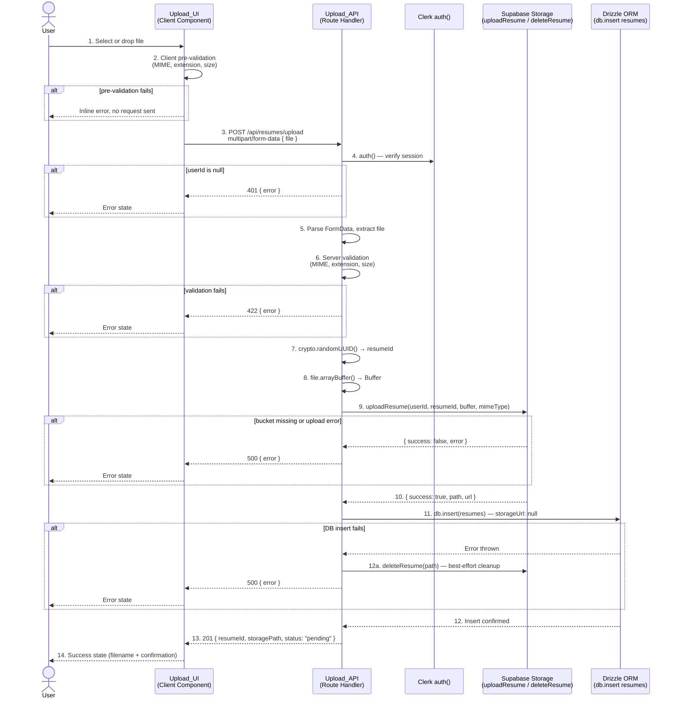

# Design Document: Resume Upload Pipeline

## Overview

The Resume Upload Pipeline is a full-stack feature that enables authenticated users to upload a PDF or DOCX resume through a drag-and-drop client component, backed by a secure Next.js Route Handler that validates, stores, and records the file.

The system is composed of two primary units:

- **Upload_API** (`app/api/resumes/upload/route.ts`) — a server-side Next.js Route Handler responsible for authentication verification, file validation, Supabase Storage upload, and Drizzle ORM database insertion.
- **Upload_UI** (`components/upload/resume-uploader.tsx`) — a client-side React component that manages file selection (drag-and-drop + file picker), client-side pre-validation, the HTTP POST lifecycle, and all UI state transitions (idle → selected → uploading → success/error).

The upload page (`app/(dashboard)/upload/page.tsx`) is modified from a static Server Component to one that imports and renders `ResumeUploader`.

All sensitive operations — Clerk identity resolution, service-role storage writes, and database inserts — occur exclusively inside the Route Handler. The browser never touches Supabase credentials or the Drizzle client.


---

## Signed URL Lifecycle Decision

### The Three Options

The `uploadResume()` function in `lib/supabase/storage.ts` performs two operations in sequence: it uploads the file buffer, then immediately calls `createSignedUrl` to produce a 1-hour signed URL. The function returns `{ success: true, path, url }`. This means a signed URL is always generated as part of every upload.

The schema column `resumes.storage_url` (nullable `text`) is the design surface for this decision.

**Option A — Persist the 1-hour signed URL at insert time**

Store the URL returned by `uploadResume()` into `resumes.storage_url` at the moment of DB insert.

- Pro: simple; no on-demand generation step needed later.
- Con: the URL expires after 1 hour. The column becomes stale almost immediately for any consumer that reads it more than an hour after upload. There is no mechanism in this codebase to refresh or re-validate stored signed URLs automatically.

**Option B — Set `storageUrl = null` at insert time; generate on-demand via `getResumeSignedUrl()`**

Discard the 1-hour URL returned by `uploadResume()` (it is used only internally to confirm the upload step completed — Supabase's `createSignedUrl` would fail if the object didn't exist). Store `null` in `resumes.storage_url`. Generate a fresh signed URL on-demand using the existing `getResumeSignedUrl(storagePath)` helper whenever a consumer needs to access the file.

- Pro: the column is never stale. Any downstream consumer always gets a fresh URL. The column is free to be populated with a more meaningful value in a future milestone.
- Con: every file access requires an additional Supabase Storage API call.

**Option C — Persist a long-lived or public URL**

Only safe if the bucket is public. The `"resumes"` bucket is private (service-role access only). This option is ruled out entirely.

### Chosen Approach: Option B

**`storageUrl` is set to `null` at insert time.**

Rationale:

1. This milestone does not display, serve, or link to the resume file anywhere in the UI. No consumer of `resumes.storage_url` exists yet, so persisting a URL that expires in 1 hour would only create stale data with no benefit.
2. `getResumeSignedUrl(storagePath)` already exists in `lib/supabase/storage.ts` and is the intended on-demand mechanism.
3. The `storageUrl` column is better reserved for the AI analysis milestone, where the access pattern may differ — for example, a URL passed to an LLM API for document retrieval, or a longer-expiry URL displayed in an analysis results view. That milestone can populate the column with the appropriate URL type at the appropriate time.
4. The signed URL returned by `uploadResume()` is still valuable internally: its successful generation confirms that the object was written to storage at the correct path. The Route Handler uses its presence (non-null) to confirm upload success before proceeding to the DB insert.

**Summary of `storageUrl` state at each milestone:**

| Milestone | `storageUrl` value |
|---|---|
| Upload Pipeline (this feature) | `null` |
| AI Analysis (future) | Populated by the analysis pipeline as needed |


---

## Architecture

The feature follows a strict client/server split enforced by the Next.js App Router module boundary.

- The **browser** only runs `ResumeUploader` (a `"use client"` component). It sends one `multipart/form-data` POST and renders state feedback.
- The **server** runs the Route Handler exclusively. It holds all privileged logic: Clerk session verification, file validation, Supabase Storage writes via service-role key, and Drizzle ORM inserts.

There are no shared modules that cross this boundary for sensitive operations. `lib/supabase/storage.ts`, `lib/supabase/server.ts`, and `db/index.ts` are server-only imports. `lib/utils.ts` is the only shared utility used in both environments.

See the [Data Flow Diagram](#data-flow-diagram) section for the end-to-end sequence.

---

## Components and Interfaces

### Upload_API (`app/api/resumes/upload/route.ts`)

The Route Handler owns all privileged operations. It is a Next.js App Router Route Handler that exports an async `POST` function. It runs exclusively in the Node.js server environment.

Responsibilities:
- Verify the Clerk session via `auth()` from `@clerk/nextjs/server`
- Parse the incoming `multipart/form-data` request and extract the `"file"` field
- Validate MIME type, file extension, and file size — in that order — before any I/O
- Generate the Resume_ID using `crypto.randomUUID()`
- Convert the file to a `Buffer` for upload
- Call `uploadResume(userId, resumeId, buffer, mimeType)` from `lib/supabase/storage.ts`
- On storage success, insert a Resume_Record using `db` from `db/index.ts`
- On DB failure, call `deleteResume(storagePath)` as best-effort cleanup
- Return consistent JSON responses (201 on success; 401, 422, or 500 on failure)

Imports (server-only):
- `auth` from `@clerk/nextjs/server`
- `uploadResume`, `deleteResume` from `@/lib/supabase/storage`
- `db`, `resumes` from `@/db`

### Upload_UI (`components/upload/resume-uploader.tsx`)

A `"use client"` React component. It owns no server-privileged operations.

Responsibilities:
- Provide drag-and-drop interaction via native `dragover`/`drop` event handlers on the drop zone `div`
- Provide click-to-browse via a hidden `<input type="file">` triggered programmatically
- Run client-side pre-validation (MIME type, extension, size) before initiating any network call
- Build a `FormData` object with `fd.append("file", file)` and POST to `/api/resumes/upload`
- Manage the upload state machine (see state model below)
- Render the appropriate UI per state, preserving all design tokens from the existing static placeholder

Imports (client-safe only):
- React state/ref/callback hooks
- `cn` from `@/lib/utils`
- `lucide-react` icons (already in project)

### Upload Page (`app/(dashboard)/upload/page.tsx`)

Remains a Server Component (no `"use client"` directive needed). Its only change is replacing the inline static JSX with an import and render of `<ResumeUploader />`. Because `ResumeUploader` has `"use client"`, Next.js handles the boundary automatically.


---

## Data Models

### `resumes` Table (existing — Drizzle schema in `db/schema/resumes.ts`)

The only table written to by this feature. Key fields used at insert time:

| Column | Type | Value at insert |
|---|---|---|
| `id` | `text` PK | `crypto.randomUUID()` |
| `user_id` | `text` FK → `users.id` | Clerk User ID from `auth()` |
| `original_name` | `varchar(260)` | `file.name` from FormData |
| `storage_path` | `text` | `{userId}/{resumeId}.{ext}` |
| `storage_url` | `text` nullable | `null` (see Signed URL Lifecycle Decision) |
| `mime_type` | `varchar(100)` | Validated `file.type` |
| `size_bytes` | `integer` | `file.size` |
| `status` | `resume_status` enum | `"pending"` |
| `is_archived` | `boolean` | `false` (schema default) |

Fields not written by this feature: `target_job_title`, `target_job_description`.

### API Request/Response Types

**Request:** `multipart/form-data` POST with a single field:
```
file: File   // The resume file (PDF or DOCX, ≤ 5 MB)
```

**Success response (201):**
```typescript
{
  resumeId:    string   // UUID v4
  storagePath: string   // "{userId}/{resumeId}.{ext}"
  status:      "pending"
}
```

**Error response (401 / 422 / 500):**
```typescript
{
  error: string   // Human-readable description; no stack traces
}
```

### UI State Type

```typescript
type UploadState =
  | { phase: "idle" }
  | { phase: "selected";  file: File }
  | { phase: "uploading"; file: File }
  | { phase: "success";   file: File; resumeId: string; storagePath: string }
  | { phase: "error";     file: File | null; message: string }
```

---

## Data Flow Diagram




---

## API Route Handler Design

**File:** `app/api/resumes/upload/route.ts`

### Processing Sequence

The handler processes requests in strict sequential steps. Each step has a defined exit point on failure; no subsequent step runs if an earlier one fails.

```
Step 1:  Auth check             → exit: 401
Step 2:  Parse FormData         → exit: 422 (no file field)
Step 3:  MIME type validation   → exit: 422
Step 4:  Extension validation   → exit: 422
Step 5:  Size validation        → exit: 422
Step 6:  Resume_ID generation   (no exit)
Step 7:  Buffer extraction      (no exit)
Step 8:  Storage upload         → exit: 500
Step 9:  DB insert              → exit: 500 (+ cleanup)
Step 10: Return 201
```

### Step 1 — Authentication

```
const { userId } = await auth()
if (!userId) return 401 { error: "Unauthorized. Please sign in to upload a resume." }
```

`auth()` is called from `@clerk/nextjs/server`. The Clerk middleware (already configured in `middleware.ts`) validates the session cookie before the route handler runs. `userId` is the Clerk User ID string (e.g. `"user_2abc…"`), directly usable as `resumes.user_id`.

### Step 2 — FormData Parsing

```
const formData = await request.formData()
const file = formData.get("file")
if (!file || !(file instanceof File)) return 422 { error: "No file provided." }
```

The `FormData` API is available natively in Next.js 15 Route Handlers. The field name `"file"` is the contract with the Upload_UI.

### Steps 3–5 — File Validation

All three validations run against the `File` object. They are checked in the order listed and return on first failure.

**MIME type (Step 3):**
```
const ALLOWED_MIME = ["application/pdf", "application/vnd.openxmlformats-officedocument.wordprocessingml.document"]
if (!ALLOWED_MIME.includes(file.type)) return 422 {
  error: `Unsupported file type "${file.type}". Accepted types: application/pdf, application/vnd.openxmlformats-officedocument.wordprocessingml.document`
}
```

**Extension (Step 4):**
```
const ext = file.name.split(".").pop()?.toLowerCase()
if (!["pdf", "docx"].includes(ext ?? "")) return 422 {
  error: `Unsupported file extension ".${ext}". Accepted extensions: .pdf, .docx`
}
```

**Size (Step 5):**
```
const MAX_BYTES = 5_242_880
if (file.size > MAX_BYTES) return 422 {
  error: `File size ${file.size} bytes exceeds the 5 MB maximum (${MAX_BYTES} bytes).`
}
```

### Step 6 — Resume ID Generation

```
const resumeId = crypto.randomUUID()
```

`crypto` is the Node.js built-in global. No import required in Node 19+ / Next.js 15. No new npm package.

### Step 7 — Buffer Extraction

```
const arrayBuffer = await file.arrayBuffer()
const buffer = Buffer.from(arrayBuffer)
```

`Buffer.from(ArrayBuffer)` is the idiomatic Node.js pattern for converting a `File` to a buffer suitable for the Supabase Storage upload.

### Step 8 — Storage Upload

```
const uploadResult = await uploadResume(userId, resumeId, buffer, file.type)
if (!uploadResult.success) {
  if (uploadResult.error.includes("Bucket not found") || uploadResult.error.includes("not found")) {
    return 500 { error: 'Storage bucket "resumes" not found. Create it in the Supabase Storage dashboard before uploading.' }
  }
  return 500 { error: `Storage upload failed: ${uploadResult.error}` }
}
const { path: storagePath } = uploadResult
// uploadResult.url (the 1-hour signed URL) is intentionally discarded — see Signed URL Lifecycle Decision.
```

`uploadResume()` is called from `lib/supabase/storage.ts`. It uses `createServiceClient()` internally, so no new Supabase client is needed in the route handler. The returned `path` follows the convention `{userId}/{resumeId}.{ext}`.

### Step 9 — Database Insert

```
await db.insert(resumes).values({
  id:           resumeId,
  userId:       userId,        // Clerk User ID — no DB lookup needed
  originalName: file.name,
  storagePath:  storagePath,
  storageUrl:   null,          // Deliberately null — see Signed URL Lifecycle Decision
  mimeType:     file.type,
  sizeBytes:    file.size,
  status:       "pending",
})
```

On failure (thrown error from Drizzle):
```
try { /* insert */ } catch (dbError) {
  // Best-effort cleanup — fire and forget
  deleteResume(storagePath).catch(cleanupError => {
    console.error("[upload] Cleanup deleteResume failed:", cleanupError)
  })
  return 500 { error: "Failed to save resume record. Please try again." }
}
```

### Step 10 — Success Response

```
return Response.json({ resumeId, storagePath, status: "pending" }, { status: 201 })
```

### Response Shapes

| Condition | Status | Body |
|---|---|---|
| Success | 201 | `{ resumeId: string, storagePath: string, status: "pending" }` |
| Not authenticated | 401 | `{ error: string }` |
| Invalid MIME type | 422 | `{ error: string }` |
| Invalid extension | 422 | `{ error: string }` |
| File too large | 422 | `{ error: string }` |
| Missing bucket | 500 | `{ error: string }` |
| Storage failure | 500 | `{ error: string }` |
| DB insert failure | 500 | `{ error: string }` |

All responses use `Response.json(body, { status })`. No stack traces, Supabase error objects, or Drizzle internals are included in any response body.


---

## Upload Client Component Design

**File:** `components/upload/resume-uploader.tsx`

### State Model

The component uses a discriminated union state machine with five states:

```
type UploadState =
  | { phase: "idle" }
  | { phase: "selected"; file: File }
  | { phase: "uploading"; file: File }
  | { phase: "success"; file: File; resumeId: string; storagePath: string }
  | { phase: "error"; file: File | null; message: string }
```

State transitions:

```
idle ──(file selected, passes pre-validation)──► selected
idle ──(file selected, fails pre-validation)───► error

selected ──(user clicks Upload)────────────────► uploading
selected ──(user selects different file)────────► selected (new file)

uploading ──(API returns 201)──────────────────► success
uploading ──(API returns error)────────────────► error

success ──(user clicks "Upload another")───────► idle
error ──(user clicks "Try again" or drops file)► idle  (or selected if new file)
```

The state is held in a single `useState` call: `const [state, setState] = useState<UploadState>({ phase: "idle" })`.

### Drag-and-Drop Event Handling

The drop zone `div` has four event handlers:

- `onDragOver` — calls `e.preventDefault()` to allow drop; applies a visual "drag active" class.
- `onDragEnter` — sets a `isDragOver` boolean state to true for visual feedback.
- `onDragLeave` — sets `isDragOver` to false.
- `onDrop` — calls `e.preventDefault()`, reads `e.dataTransfer.files[0]`, and passes it through `handleFileSelected()`.

`isDragOver` is a separate `boolean` state (not part of the main state union) used only for drop zone styling (`ring-2 ring-primary` when active).

### Hidden File Input Approach

A `<input type="file" ref={fileInputRef} accept=".pdf,.docx" className="sr-only" onChange={...} />` element is rendered but visually hidden using `sr-only`. The "Browse Files" button and the drop zone area both call `fileInputRef.current?.click()` on activation to trigger the native OS file picker.

This avoids custom `<label>` focus hacks while preserving keyboard navigability: the `<button>` element is natively focusable and activatable with Enter/Space.

### Pre-validation Logic

`handleFileSelected(file: File)` is called by both drag-and-drop and the file input `onChange`. It runs:

```
1. MIME type: file.type must be in ALLOWED_MIME_TYPES array
2. Extension: file.name.split(".").pop().toLowerCase() must be in ["pdf", "docx"]
3. Size: file.size <= 5_242_880
```

On any failure: `setState({ phase: "error", file: null, message: <descriptive message> })`
On all pass: `setState({ phase: "selected", file })`

This mirrors the server-side validation logic and is explicitly a convenience layer, not the authoritative check.

### fetch() Call Construction

When the user confirms the upload (clicks the "Upload" button from the `selected` state):

```
const fd = new FormData()
fd.append("file", state.file)

setState({ phase: "uploading", file: state.file })

const res = await fetch("/api/resumes/upload", { method: "POST", body: fd })
const json = await res.json()

if (res.ok) {
  setState({ phase: "success", file: state.file, resumeId: json.resumeId, storagePath: json.storagePath })
} else {
  setState({ phase: "error", file: state.file, message: json.error ?? "Upload failed. Please try again." })
}
```

No `Content-Type` header is set manually — the browser sets it automatically with the correct `multipart/form-data; boundary=...` value when passing a `FormData` body to `fetch`.

### UI Rendering Per State

| State | Drop zone content | Button |
|---|---|---|
| `idle` | Upload icon + "Drag & drop" + "PDF or DOCX · Max 5 MB" | "Browse Files" |
| `selected` | FileText icon + filename + file size | "Upload Resume" (primary) + "Choose different file" (ghost) |
| `uploading` | Spinner + "Uploading…" + filename | Disabled "Uploading…" button |
| `success` | CheckCircle icon (success color) + filename + "Successfully uploaded" | "Upload another resume" |
| `error` | AlertCircle icon (error color) + error message | "Try again" |

During `uploading`, both the button and the drop zone have `pointer-events-none` and `opacity-50` to prevent duplicate submissions.

### Accessibility Considerations

- Drop zone `div` has `role="region"` and `aria-label="Resume upload drop zone"`.
- Drop zone has `tabIndex={0}` and `onKeyDown` handler to trigger file picker on Enter/Space (for keyboard users who cannot use drag-and-drop).
- The hidden file input has `aria-hidden="true"` since the button provides the accessible interaction point.
- Error messages are rendered in a `<p role="alert">` so screen readers announce them immediately.
- Success state announces the filename and confirmation via `role="status"`.
- All icon elements have `aria-hidden="true"`.
- The upload button uses `aria-busy={state.phase === "uploading"}` during loading.
- Focus is managed: after a file is selected, focus moves to the "Upload Resume" button to guide keyboard users to the next action.

### Design Tokens

The component preserves all tokens from the existing static placeholder:

- Container card: `rounded-2xl border border-border bg-surface p-6 shadow-sm`
- Drop zone: `rounded-xl border-2 border-dashed border-border bg-surface-subtle`
- Icon container: `bg-primary-light ring-1 ring-primary-muted`
- Icon: `text-primary`
- Heading: `text-foreground`
- Subtext: `text-foreground-subtle` / `text-foreground-muted`
- Primary button: `bg-primary text-white hover:bg-primary-hover`
- Error state: `text-error bg-error-light`
- Success state: `text-success bg-success-light`
- Drag-active drop zone: `ring-2 ring-primary bg-primary-light`


---

## Database Write Design

**Table:** `resumes`  
**Operation:** `db.insert(resumes).values({ ... })`  
**Drizzle instance:** `db` from `@/db` (re-exported from `db/drizzle.ts`)

### Fields Written at Insert Time

| Column | Value | Source |
|---|---|---|
| `id` | `crypto.randomUUID()` | Generated in Step 6 |
| `user_id` | Clerk User ID string | `auth().userId` — no DB lookup |
| `original_name` | `file.name` | From `File` object in FormData |
| `storage_path` | `uploadResult.path` | Returned by `uploadResume()` |
| `storage_url` | `null` | **Explicitly null** — see Signed URL Lifecycle Decision |
| `mime_type` | `file.type` | Validated in Step 3 |
| `size_bytes` | `file.size` | Validated in Step 5 |
| `status` | `"pending"` | Hardcoded enum value |
| `is_archived` | `false` | Schema default — not set explicitly |
| `created_at` | `now()` | Schema default — not set explicitly |
| `updated_at` | `now()` | Schema default — not set explicitly |

Fields NOT written at this milestone:
- `target_job_title` — null (out of scope)
- `target_job_description` — null (out of scope)

### `storageUrl` Value Justification

`storageUrl` is set to `null`. The signed URL produced by `uploadResume()` is a 1-hour temporary URL. Persisting it would result in stale data within the hour. No consumer reads `storageUrl` in this milestone. The column is reserved for a future milestone (AI analysis pipeline) that will populate it with an appropriate access URL at the right time.

### `status = "pending"` Rationale

`"pending"` is the first value in the `resume_status` enum: `("pending", "processing", "analyzed", "failed")`. It signals that the resume has been received and stored but has not yet been analyzed. This is the correct initial state. The analysis pipeline (a future milestone) will transition the record through `"processing"` → `"analyzed"` or `"failed"`.

### User Identity

`resumes.user_id` receives `auth().userId` directly. `users.id` IS the Clerk User ID (confirmed by the webhook handler in `app/api/webhooks/clerk/route.ts`, which sets `id: data.id` and `clerkId: data.id` to the same value). No intermediate `SELECT id FROM users WHERE clerk_id = $1` query is needed or performed. The foreign key constraint `resumes.user_id → users.id` is satisfied because the user record was created by the Clerk webhook at sign-up time.


---

## Error Handling

See the [Error Handling Matrix](#error-handling-matrix) section for the full table. Key design decisions:

- **Fail fast**: Auth and validation failures return immediately. No I/O runs until the file is confirmed valid.
- **No partial state**: A storage object without a DB record triggers best-effort cleanup via `deleteResume()`. A DB record is never inserted without a confirmed storage object.
- **Opaque errors**: All 500 responses return a generic human-readable message. Raw error strings from Supabase or Drizzle are logged server-side only; they are never forwarded to the client.
- **Cleanup is non-blocking**: `deleteResume()` on DB failure is fire-and-forget. Its success or failure does not change the HTTP response.

---

## Error Handling Matrix

| Scenario | Trigger Condition | Action Taken | HTTP Status | Response Body |
|---|---|---|---|---|
| Unauthenticated request | `auth().userId` is null/undefined | Return immediately | 401 | `{ error: "Unauthorized. Please sign in to upload a resume." }` |
| No file in request | FormData `"file"` field missing or not a `File` | Return immediately | 422 | `{ error: "No file provided." }` |
| Invalid MIME type | `file.type` not in allowlist | Return immediately | 422 | `{ error: "Unsupported file type \"<type>\". Accepted types: …" }` |
| Invalid file extension | Extension not `.pdf` or `.docx` | Return immediately | 422 | `{ error: "Unsupported file extension \".<ext>\". Accepted extensions: .pdf, .docx" }` |
| File exceeds 5 MB | `file.size > 5_242_880` | Return immediately | 422 | `{ error: "File size <n> bytes exceeds the 5 MB maximum (5242880 bytes)." }` |
| Storage bucket missing | `uploadResume()` returns `success: false` with bucket-not-found message | Return immediately | 500 | `{ error: "Storage bucket \"resumes\" not found. Create it in the Supabase Storage dashboard before uploading." }` |
| Storage upload failure (other) | `uploadResume()` returns `success: false` for any other reason | Return immediately | 500 | `{ error: "Storage upload failed: <message>" }` |
| DB insert failure | `db.insert(resumes)` throws | Call `deleteResume(storagePath)` (best-effort, fire-and-forget); log any cleanup error; return 500 | 500 | `{ error: "Failed to save resume record. Please try again." }` |
| Cleanup deletion failure | `deleteResume()` throws during DB-failure cleanup | Log the error; do NOT rethrow; 500 is returned regardless | 500 | Same as DB insert failure |

**Invariants maintained by this matrix:**

1. No storage write occurs before validation passes.
2. No DB write occurs before storage write confirms success.
3. A storage object without a DB record is resolved by best-effort cleanup on DB failure.
4. A DB record without a storage object cannot be created (DB insert only runs on `uploadResult.success === true`).


---

## Security Design

### Server/Client Boundary

The Next.js App Router enforces a hard module boundary between server and client code. The Route Handler file (`app/api/resumes/upload/route.ts`) runs only in the Node.js server runtime. The Client Component (`components/upload/resume-uploader.tsx`) runs in the browser.

The Upload_UI communicates with the Upload_API exclusively via a standard `fetch()` POST request carrying `FormData`. It has no knowledge of Supabase, Drizzle, or Clerk's internal session verification.

### SUPABASE_SERVICE_ROLE_KEY Protection

`SUPABASE_SERVICE_ROLE_KEY` is accessed only inside `createServiceClient()` in `lib/supabase/server.ts`. That function is called inside `uploadResume()` and `deleteResume()` in `lib/supabase/storage.ts`, which are only ever called from the Route Handler. The environment variable has no `NEXT_PUBLIC_` prefix, so Next.js will not include it in any client-side bundle. No new environment variables are introduced.

### Identity Spoofing Prevention

`auth()` from `@clerk/nextjs/server` reads the Clerk session cookie, which is cryptographically signed by Clerk's servers and validated by the Clerk middleware. It is not possible for a client to supply a forged `userId` in the request body or headers and have it accepted — the Route Handler reads the identity exclusively from `auth().userId` and ignores any `userId`-like fields in the request body.

### Service Client vs Anon Client

`uploadResume()` in `lib/supabase/storage.ts` calls `createServiceClient()` (service role, bypasses RLS) for all storage operations. The anon client (`lib/supabase/client.ts`) is never imported or called in the Route Handler or in the storage helpers used by this feature. RLS on the storage bucket therefore doesn't need to be configured for uploads — the service role key is used.

### No New Attack Surface

No new environment variables, no new Supabase clients, no new Drizzle instances, no new utility libraries. The attack surface is unchanged from what already exists in the project.


---

## File Conventions and Naming

### Storage Path Format

```
{clerkUserId}/{resumeId}.{ext}
```

- `{clerkUserId}` — the Clerk User ID string, e.g. `user_2abc123xyz`
- `{resumeId}` — a UUID v4 string generated by `crypto.randomUUID()`, e.g. `f47ac10b-58cc-4372-a567-0e02b2c3d479`
- `{ext}` — either `pdf` or `docx`, derived from the MIME type in `uploadResume()` (`mimeType.includes("pdf") ? "pdf" : "docx"`)

Example: `user_2abc123xyz/f47ac10b-58cc-4372-a567-0e02b2c3d479.pdf`

This path is the Storage_Path stored in `resumes.storage_path`. The outer bucket name (`"resumes"`) is not part of the path stored in the column — it is an argument to `supabase.storage.from(BUCKET)`.

### Resume ID Format

UUID v4 generated by `crypto.randomUUID()`. Format: `xxxxxxxx-xxxx-4xxx-yxxx-xxxxxxxxxxxx`. This is the value stored in `resumes.id` and returned in the 201 response as `resumeId`.

### MIME Type Allowlist

| MIME Type | Extension | Description |
|---|---|---|
| `application/pdf` | `.pdf` | PDF document |
| `application/vnd.openxmlformats-officedocument.wordprocessingml.document` | `.docx` | Microsoft Word (Open XML) |

Both MIME type AND extension are validated independently. A file with a valid MIME type but wrong extension (or vice versa) is rejected. This prevents trivially renaming a disallowed file type.

### File Size Limit

Maximum: `5,242,880` bytes (5 MiB = 5 × 1,024 × 1,024).

### FormData Field Name

The file must be submitted under the field name `"file"`. This is the contract between Upload_UI and Upload_API.


---

## Correctness Properties

*A property is a characteristic or behavior that should hold true across all valid executions of a system — essentially, a formal statement about what the system should do. Properties serve as the bridge between human-readable specifications and machine-verifiable correctness guarantees.*

The following properties are derived from the prework analysis of each acceptance criterion. Only criteria that are universal across a range of inputs and test code we write (not external service behavior) are promoted to properties.

**Property Reflection:** Before listing properties, redundant and overlapping candidates were consolidated:
- Criteria 4.6, 5.6, 11.3, and 11.4 all express the same invariant: "no DB write without a successful storage write." These are merged into a single Property 4.
- Criteria 5.4 and 11.1 both express the cleanup invariant. Merged into Property 5.
- Criteria 4.2 and the path field in 6.1 both involve the path format. Path format is covered as part of Property 6.

---

### Property 1: Any non-allowlisted MIME type is rejected before I/O

*For any* file whose `type` property is not in `["application/pdf", "application/vnd.openxmlformats-officedocument.wordprocessingml.document"]`, the Upload_API SHALL return a 422 response and SHALL NOT invoke `uploadResume()` or `db.insert()`.

**Validates: Requirements 2.1, 2.4, 2.7**

---

### Property 2: Any non-allowlisted file extension is rejected before I/O

*For any* file whose name does not end with `.pdf` or `.docx` (case-insensitive), the Upload_API SHALL return a 422 response and SHALL NOT invoke `uploadResume()` or `db.insert()`.

**Validates: Requirements 2.2, 2.5, 2.7**

---

### Property 3: Any file exceeding the size limit is rejected before I/O

*For any* file whose `size` in bytes is greater than `5,242,880`, the Upload_API SHALL return a 422 response and SHALL NOT invoke `uploadResume()` or `db.insert()`.

**Validates: Requirements 2.3, 2.6, 2.7**

---

### Property 4: No database write occurs without a confirmed storage write

*For any* upload attempt where `uploadResume()` returns `{ success: false }` (for any error reason), the Upload_API SHALL NOT call `db.insert()` and SHALL return an HTTP 500 response.

**Validates: Requirements 4.6, 5.6, 11.3, 11.4**

---

### Property 5: Storage cleanup is attempted on every database insert failure

*For any* upload attempt where `uploadResume()` succeeds but `db.insert()` throws (for any error reason), the Upload_API SHALL call `deleteResume(storagePath)` with the exact path returned by `uploadResume()`.

**Validates: Requirements 5.4, 11.1, 11.2**

---

### Property 6: The 201 response contains correct, consistent fields for any valid upload

*For any* valid authenticated request (any Clerk userId) with a valid file (any allowed MIME type, extension, size ≤ 5 MB), a successful upload SHALL return a 201 response body containing: `resumeId` (a valid UUID v4 string), `storagePath` (matching the pattern `{userId}/{resumeId}.{ext}`), and `status` equal to `"pending"`.

**Validates: Requirements 3.1, 3.2, 4.2, 6.1**

---

### Property 7: The inserted Resume_Record contains all required fields for any valid upload

*For any* valid authenticated upload, the Resume_Record inserted into `resumes` SHALL contain: `id` equal to the returned `resumeId`, `userId` equal to `auth().userId`, `originalName` equal to the file's original filename, `storagePath` equal to the path returned by `uploadResume()`, `storageUrl` equal to `null`, `mimeType` equal to the validated MIME type, `sizeBytes` equal to `file.size`, and `status` equal to `"pending"`.

**Validates: Requirements 5.1, 5.2, 5.3**

---

### Property 8: Client pre-validation blocks any invalid file from reaching the Upload_API

*For any* file selected in the Upload_UI whose MIME type, extension, or size fails the client-side checks, the component SHALL display an inline error message and SHALL NOT invoke `fetch("/api/resumes/upload")`.

**Validates: Requirements 9.1, 9.2, 9.3, 9.4**

---

## Testing Strategy

### PBT Applicability Assessment

The Upload_API contains pure validation logic (MIME type checking, extension checking, size comparison, path construction, response shaping) that has clear inputs and outputs and varies meaningfully over a wide input space. Property-based testing is appropriate for this logic layer.

UI state transitions are better covered by example-based component tests, not PBT.

### Dual Testing Approach

**Property-based tests** (using a PBT library for TypeScript/Node.js, such as [fast-check](https://fast-check.dev/)):
- Test the validation logic and response shapes against generated inputs
- Run minimum 100 iterations per property
- Mock `uploadResume()`, `deleteResume()`, `db.insert()`, and `auth()` to keep tests pure and fast
- Tag format: `// Feature: resume-upload-pipeline, Property <N>: <property text>`

**Example-based unit tests**:
- Specific scenarios: 401 on null userId, 422 on empty FormData, 500 on bucket-not-found
- Component tests for each UI state transition (idle → selected → uploading → success/error)
- Verify no stack traces in error responses

**Integration tests** (against a real or test Supabase project):
- Confirm a valid upload creates a row in `resumes` and an object in the `"resumes"` bucket
- Confirm the storagePath in the DB row matches the object path in Storage
- 1–3 representative examples, not parameterized

### Property Test Configuration

Each property test corresponds to one of the 8 correctness properties above. Generators produce:
- Arbitrary strings for MIME type and filename (Properties 1–2)
- Arbitrary integers for file size (Property 3)
- Arbitrary error strings from mock storage/DB (Properties 4–5)
- Arbitrary valid `(userId, file)` combinations (Properties 6–7)
- Arbitrary invalid files from the client side (Property 8)

Minimum iterations: 100 per property. All Supabase and DB calls are mocked — no external I/O in property tests.

